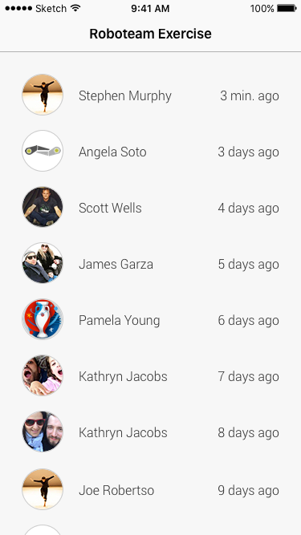
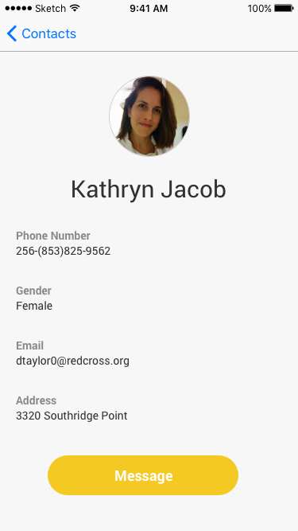

>原内容:     
Task description
• Create a mobile app that loads and display a contacts list with specific details of
the contacts (See attached mockup A)
• Sort the list by date
• Allow the user to tap a contact and display the contact details view with the
contact’s details as described in the mockup (B)
• In details view allow the user to tap the “Call” button and send a simple
message to a recipient on a different device - (Please use
https://www.pubnub.com/ or any other Publish-Subscribe service)
• On the recipient device display the notification
Guidelines
• Support portrait mode only
• Try to achieve the exact UI that is in the mockup
• Consider multiple screen sizes
• Consider best UX:
• Loading spinners
• Page transitions
• Pull to refresh
Comments:
• We assume this exercise should take about 6-8 hours
• Feel free to contact us with any questions
• Feel free to use any 3rd party library but make sure the core code is yours
Contacts JSON:
https://raw.githubusercontent.com/leslieam/contacts/master/
contacts_mock_short.json
Good luck!

----------
>翻译
####任务描述：

- 创建app加载并显示联系人列表，包含特定信息（参考附件联系人列表） 
- 按照日期排序
- 通过点击列表条目跳转到详情页（详情页参考附件详情）
- 在详情页可以点击，message 按钮发送一个简单的消息到一个接受设备。（请使用https://www.pubnub.com/ 或者其他第三方公开库）
- 接收设备上显示，消息提示。

####指引
- 仅支持竖屏
- 尝试完全还原UI设计
- 考虑屏幕适配
- 最优用户体验
- 加载动画
- 页面跳转（可加动画）
- 下拉刷新

####评论：
- 使用6-8小时
- 有任何问题请联系我们
- 可使用第三方库，但是核心代码必须是自己的。

 
附件图片：  
联系人列表：  

详情页：   

